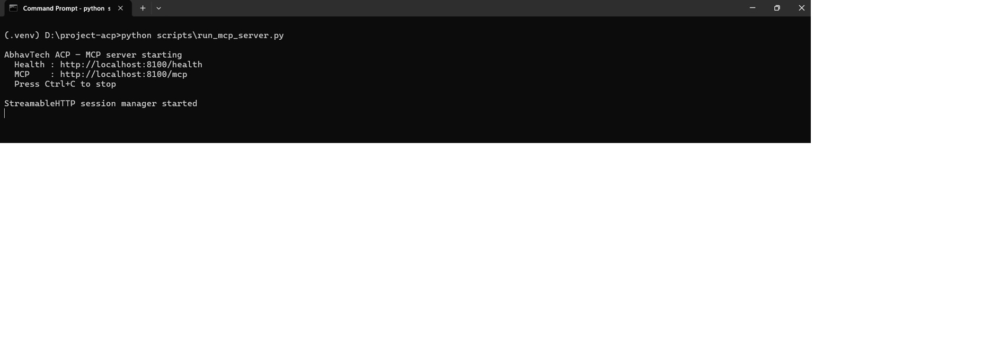
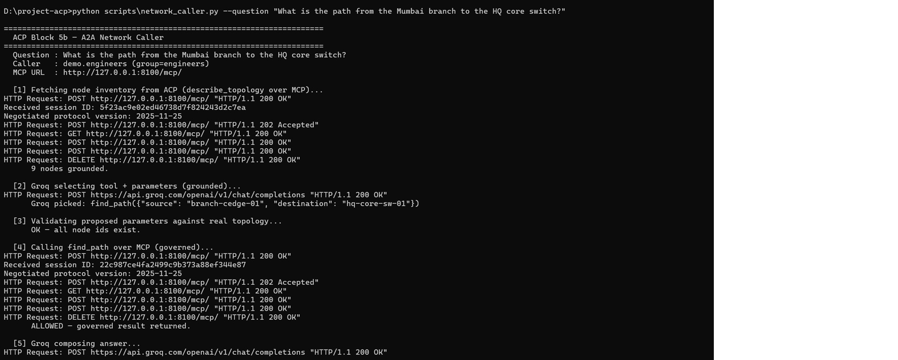
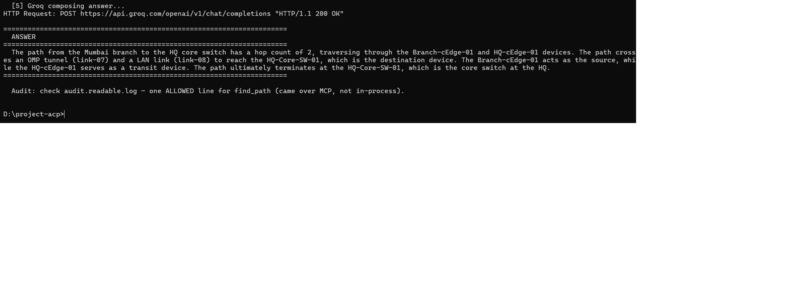
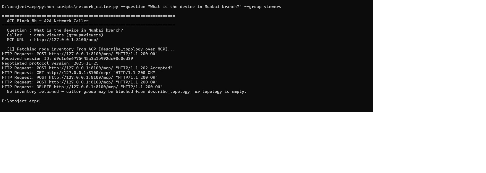

# Agentic Control Plane (ACP)

**Rajmohan Mangattu | CCIE Collaboration #55207**

> LAB PROTOTYPE — built to demonstrate governed agentic AI architecture
> at enterprise scale, combining  years of Cisco UC/CC/networking
> expertise with modern AI engineering.

---

## What this is

The Agentic Control Plane (ACP) is a governed MCP (Model Context Protocol)
server that sits between AI agents and domain knowledge — enforcing OAuth 2.1
scope checking, policy-driven access control, and a full audit trail on every
tool call.

It is not a chatbot. It is the **governance layer** that enterprise AI
deployments need before autonomous agents can be trusted in regulated
industries.

---

## The A2A boundary — what this demonstrates

```
Natural language question
        ↓
network_caller.py (MCP client)
  — grounds LLM with real inventory
  — Groq picks tool + parameters
  — validates against real topology
        ↓  real MCP protocol over HTTP
ACP on port 8100 (MCP server)
  — decodes JWT token
  — checks control_hub.yaml policy
  — runs domain tool
  — writes audit line
        ↓
Prose answer + governed audit trail
```

**Demo run:**

```
Question : "What is the device in Mumbai branch?"
Groq picks: check_device_role(node=branch-cedge-01)
ACP says  : ALLOWED — governance passed
Answer    : Cisco ISR1100 IOS-XE SD-WAN cEdge, spoke role,
            5 peers, dual-transport MPLS + internet
Audit     : tool=check_device_role decision=ALLOWED written to audit.readable.log
```

---

## Demo — the A2A boundary in action

A natural-language question about a Cisco SD-WAN network, answered end to end
through the governed MCP boundary.

### 1. ACP server running

The governed MCP server starts and serves both `/health` and `/mcp` on port 8100.



### 2. The A2A flow — natural language to governed tool call

The caller grounds the LLM with real inventory, Groq picks `find_path` with the
correct parameters, the code validates them against the real topology, then calls
ACP over the real MCP protocol.



### 3. The governed answer

Groq composes a prose answer from the governed result — every fact traced to the
topology, crossing the SD-WAN OMP tunnel.



### 4. Governance blocks an unauthorized caller

The same question with a `viewers` token. Governance blocks the flow at the first
tool call — no inventory returned, no answer, distinct audit reason.



---

## Architecture

```
┌─────────────────────────────────────────────────────────┐
│  network_caller.py — A2A caller                         │
│  Groq tool router + validation guard + prose writer     │
└──────────────────────────┬──────────────────────────────┘
                           │ MCP protocol (HTTP port 8100)
                           ▼
┌─────────────────────────────────────────────────────────┐
│  ACP governed MCP server                                │
│  ┌──────────────────┬──────────────────────────────┐   │
│  │ Track C          │ Track N                       │   │
│  │ search_wxcc_     │ describe_topology             │   │
│  │ corpus           │ find_path                     │   │
│  │                  │ check_device_role             │   │
│  └──────────────────┴──────────────────────────────┘   │
│  OAuth 2.1 scopes + control_hub.yaml + audit trail      │
└─────────────────────────────────────────────────────────┘
```

### Two domain modules

**Track C — Contact Center**
Searches a corpus of 2,633 chunks of Cisco Webex Contact Center knowledge
(BGE-M3/1024-dim embeddings, Qdrant Cloud). Returns Tier 1 sourced, grounded
answers to specific deployment, compliance, and design questions — with
provenance tracking so every answer traces back to its source document.

**Track N — Network**
Three tools over a Cisco SD-WAN topology descriptor (9 nodes, 11 links):

* `describe_topology` — nodes, links, sites, SD-WAN hub/spoke summary
* `find_path` — BFS shortest L3 hop path between any two nodes
* `check_device_role` — role, platform, and peer connections for a named node

### Governance on every call

Every tool call goes through two checks before the domain function runs:

1. **Group policy** — is this tool Allowed or Blocked for the caller's group
in `control_hub.yaml`?
2. **Scope check** — does the JWT token carry the required scope
(`knowledge:read` or `diagnostics:run`)?

Both refusal types write distinct audit lines to `audit.readable.log` with
the reason. Allowed calls write an ALLOWED line. Nothing reaches the domain
tool without passing both checks.

---

## Key design decisions

**ACP has its own direct path to the data**
Rather than routing through the WxCC SLM's API, ACP keeps its own
database client and embedder. This means the two systems are independent —
if the SLM goes down, ACP still works. They share the data, not the code.

**Governance is a parameter, not a dependency**
The governance function is passed into each tool as an argument rather than
imported directly. This keeps the code clean and avoids circular dependencies —
the tool doesn't need to know anything about the server that hosts it.

**The LLM proposes, the code decides**
When the A2A caller asks Groq to pick a tool parameter (like a node name),
it doesn't just trust the answer blindly. Every parameter is checked against
the real data before any call goes to ACP. If the LLM guesses a node that
doesn't exist, the caller rejects it and shows what's actually available.


---

## How to run

### Prerequisites

* Python 3.11 (ACP venv)
* Qdrant Cloud account — collection `wxcc_slm_corpus`
* Groq API key — https://console.groq.com/keys
* BGE-M3 cached at `D:\\hf_cache` (or set `HF_HOME` to your cache path)

### Setup

```bash
git clone https://github.com/Rajmohan80/project-acp.git
cd project-acp
python -m venv .venv
.venv\\Scripts\\activate
pip install -e .
cp .env.example .env
# Fill in .env with your real values
```

### Run the A2A demo (two terminals)

**Terminal 1 — start ACP server:**

```bash
python scripts\\run_mcp_server.py
```

Wait for: `Uvicorn running on http://0.0.0.0:8100`

**Terminal 2 — run the A2A caller:**

```bash
python scripts\\network_caller.py --question "What is the device in Mumbai branch?"
```

Try `--group viewers` to see governance block the flow.

### Run the WxCC corpus tool demo

```bash
python scripts\\demo_wxcc.py --query "What are the WxCC data residency requirements for UAE?"
```

### Run the Track N topology tools demo

```bash
python scripts\\demo_network.py
```

---

## Repository structure

```
src/
  core/
    mcp/
      server/app.py          — governed MCP server, all tools registered
      control_hub.yaml       — allow/block policy per group per tool
      oauth/issuer.py        — JWT token minter (port 9000)
    audit/writer.py          — every decision → audit.readable.log
    common/config.py         — settings from .env, fails loud on missing vars
  domains/
    contact_center/
      corpus_client.py       — BGE-M3 + Qdrant client (Track C)
      tool.py                — search_wxcc_corpus governed tool
    network/
      topology_store.py      — JSON topology loader, BFS path finder
      tool.py                — describe_topology, find_path, check_device_role
      topologies/
        sample_sdwan_branch.json  — 9-node SD-WAN topology descriptor
scripts/
  run_mcp_server.py          — starts ACP as standing HTTP service
  network_caller.py          — A2A caller (grounded LLM + MCP client)
  demo_wxcc.py               — Track C validation
  demo_network.py            — Track N validation (6 runs)
docs/
  naming-map.md              — ACP ↔ Cisco concept mapping
  BLOCK_5A_MCP_TRANSPORT.md  — how the MCP HTTP transport was wired
  BLOCK_5_A2A_BOUNDARY.md    — A2A boundary design and validated output
  A2A_FLOW_DIAGRAM.md        — flow diagram + step-by-step explanation
```

---

## Governance proof — what the audit log shows

After running the demo, `audit.readable.log` contains entries like:

```json
{"actor": "demo.engineer", "tool": "check_device_role",
 "outcome": "ALLOWED", "refusal_reason": "NONE", ...}

{"actor": "demo.viewer", "tool": "check_device_role",
 "outcome": "REFUSED", "refusal_reason": "TOOL_BLOCKED_IN_CONTROL_HUB", ...}
```

Two callers, same tool, different outcomes — based purely on the signed JWT
token's group claim. The governance layer cannot be bypassed.

---

## Related projects

* **wxcc-slm** — the domain AI this project governs:
https://github.com/Rajmohan80/wxcc-slm

---

## Stack

|Component|Technology|
|-|-|
|MCP server|FastMCP 3.4.5 (streamable-http)|
|OAuth issuer|FastAPI + python-jose (JWT)|
|Policy enforcement|control_hub.yaml (YAML, no code change needed)|
|Audit trail|TinyDB → audit.readable.log|
|Embeddings|BGE-M3 (BAAI/bge-m3, 1024-dim, sentence-transformers)|
|Vector DB|Qdrant Cloud|
|LLM|Groq Llama-3.3-70B-versatile|
|Runtime|Python 3.11, uvicorn|

---

*Rajmohan Mangattu | CCIE Collaboration #55207
Lab prototype — not production ready. Built to demonstrate governed
agentic AI architecture for enterprise contact center and network domains.*

